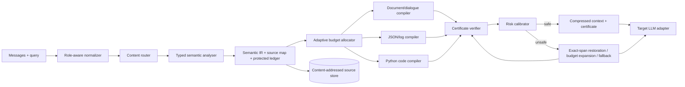
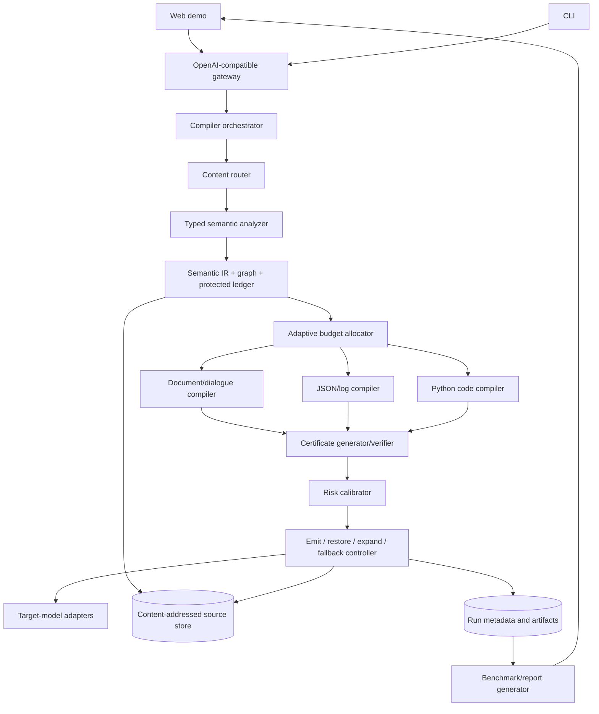

# TraceFold Product Specification

> **Project:** Innova Hack Chapter 1, Round 2  
> **Track:** Gen AI  
> **Problem Statement:** PS 2, Ultra-Low Resource LLM Context Compression Engine  
> **Working product name:** TraceFold  
> **Tagline:** A reasoning-preserving semantic compiler for LLM context  
> **Document status:** Research-revised, build-ready product specification  
> **Last updated:** 1 August 2026, 12:36 IST  
> **Research revision:** Competitive-landscape findings from `deep-research-report.md` incorporated selectively

---

## 0. Evidence labels used in this document

This specification deliberately separates source-backed facts from design choices.

- **[OFFICIAL]** Directly stated in the official problem-statement PDF.
- **[RESEARCH]** Supported by published prompt-compression or long-context research listed in the references.
- **[PROPOSAL]** Our product, algorithm, metric, architecture, or demo recommendation.
- **[ASSUMPTION]** A planning assumption that must be validated during implementation.

---

## 1. Problem statement and mandate

### 1.1 Official challenge

**[OFFICIAL]** Long contextual histories such as codebases and customer logs create memory overhead, latency, and API cost. The challenge identifies repetitive syntax and filler boilerplate as avoidable context. The solution must:

1. Build an **algorithmic token pre-processor** that removes semantic redundancy from prompt windows.
2. Reduce prompt size by **more than 70%** before the prompt is sent to the target model.
3. Retain **95% or more of original downstream answer accuracy**.
4. Be evaluated on:
   - compression ratio,
   - cost reduction,
   - reasoning retention,
   - inference-latency speedup.

Source: official PDF, page 11.

### 1.2 Product interpretation

**[PROPOSAL]** TraceFold will be a model-agnostic **proof-carrying adaptive context compiler**. It accepts a long prompt plus an optional query, compiles the prompt into a shorter representation, and emits both the compressed context and machine-checkable evidence explaining what was preserved, what was removed, and why the result was trusted.

The internal selection algorithm remains **Constraint-Preserving Reasoning-Graph Compression (CPRGC)**. The product-level differentiator is broader: CPRGC is wrapped in a typed semantic intermediate representation, selective-lossless policies, a preservation certificate, calibrated risk estimation, and exact-span restoration.

TraceFold is not positioned as another summarizer or merely a multi-format router. Its product contract is:

1. **Critical invariants remain exact.** Instructions, identifiers, quantities, units, negations, exceptions, permissions, temporal order, and required relations are losslessly retained.
2. **Reasoning obligations remain connected.** Evidence paths and dependency edges are protected, not just isolated high-salience tokens.
3. **Every preservation claim is auditable.** The output includes hashes, protected-class coverage, source mappings, failed invariants, risk, and the final compress/expand/fallback decision.
4. **Unsafe compression is repaired or refused.** The system restores the smallest necessary source spans, lowers the compression ratio, or passes through the original context.
5. **Efficiency is measured end to end.** Compressor work, verification, fallbacks, output-token changes, and cache effects are included where measurable.

---

## 2. Product vision

### 2.1 Vision

**[PROPOSAL]** Make long-context LLM inference cheaper and faster without turning reasoning into a game of informational Jenga.

### 2.2 Core product claim

> For supported document, JSON/log, dialogue, and Python-code contexts, TraceFold targets more than 70% average input-token reduction while preserving at least 95% of the full-context downstream task score at a declared certified operating point. It reports raw, certified, and fallback-adjusted performance separately.

This is a target, not a pre-claimed result. It is explicitly distribution-level, not a universal guarantee for every arbitrary prompt.

### 2.3 Winning thesis

**[PROPOSAL]** The strongest technical story is:

> **TraceFold compiles heterogeneous context into a typed semantic IR, selects a minimum sufficient reasoning subgraph, preserves high-risk invariants losslessly, and emits a machine-verifiable certificate that triggers exact-span restoration when its guarantees fail.**

The key competitive lesson from the research report is that content-type routing, AST compression, compact JSON, query-aware pruning, and reversible retrieval already exist separately in systems such as Headroom, LLMLingua, Repomix, and TOON. TraceFold must therefore win on **preservation assurance**, not on claiming to be the first context compiler.

## 3. Users and use cases

### 3.1 Primary users

| User | Need | TraceFold value |
|---|---|---|
| LLM platform engineer | Reduce input-token spend and time to first token | Drop-in middleware with measurable savings |
| AI application developer | Fit long histories into smaller model windows | Query-aware compression with adapters |
| SRE or support analyst | Reason over repetitive logs and tickets | Template and delta compression while preserving anomalies |
| Developer-tool builder | Feed repository context to coding models | AST-aware code slicing and symbol preservation |
| Research evaluator | Compare compression methods rigorously | Reproducible benchmark harness and Pareto reports |

### 3.2 Demonstration use cases

**[PROPOSAL]** The live demo should cover three visibly different context types:

1. **Multi-hop document QA:** answer requires connecting facts from separated passages.
2. **Incident-log diagnosis:** thousands of repetitive lines contain a few causal anomalies, IDs, timestamps, and error transitions.
3. **Repository reasoning:** answer depends on cross-file symbol definitions and call chains.

This breadth supports the claim that TraceFold is infrastructure, not a one-dataset trick.

---

## 4. Goals, non-goals, and success gates

### 4.1 P0 goals

- Achieve measured token reduction above 70% on the declared primary suite.
- Achieve downstream score retention at or above 95% at the certified operating point.
- Report three result views: raw compressor, certified subset, and end-to-end with restoration/fallback.
- Support three distinct compiler paths: documents/dialogue, structured JSON/logs, and Python code.
- Produce a typed protected-fact ledger, exact source map, and machine-verifiable preservation certificate.
- Calibrate a semantic-loss risk score on a frozen validation set and report its reliability.
- Beat simple truncation, embedding Top-K, and at least one established academic compressor at matched token budgets.
- Compare directly with Headroom where reproducible; otherwise provide a source-backed feature comparison without fabricated numbers.
- Report end-to-end latency and net cost, including compression, verification, fallback, and output-token changes.
- Provide a demo with an intentional certificate failure followed by exact-span restoration.
- Expose CLI and OpenAI-compatible HTTP interfaces.

### 4.2 P1 goals

- Add DAC as a dynamic attention-entropy baseline.
- Add TOON/compact-JSON comparison for structured data and Repomix comparison for code.
- Add selective differential answer probes for high-risk cases.
- Show risk-coverage and compression-retention Pareto curves.
- Support a trained lightweight retention/risk ranker as an optional extension.
- Add exact span retrieval for follow-up questions whose query changes.
- Publish the deterministic `ContextProofBench` corruption benchmark.

### 4.3 Non-goals

- Modifying the target LLM architecture or KV cache.
- Claiming lossless compression for arbitrary tasks.
- Replacing retrieval systems or vector databases.
- Generating an abstractive summary with no source traceability.
- Optimizing output-token generation or chain-of-thought length.
- Claiming universal 95% retention before benchmark evidence exists.

### 4.4 Release gates

| Gate | Required result |
|---|---|
| G1: Functional | Input can be compiled and passed to a target-model adapter end to end |
| G2: Official threshold | Average reduction >70% and task-score retention >=95% at the declared certified operating point |
| G3: Proof | Certificate fields are independently recomputable and every retained claim maps to source |
| G4: Calibration | Risk score has reported Brier score/ECE and a visible risk-coverage curve |
| G5: Competitive | Better matched-budget retention than truncation and Top-K; credible comparison with LLMLingua-2 and Headroom |
| G6: Technical novelty | Protected ledger, reasoning graph, certificate verification, and restoration each show measurable ablation value |
| G7: Demo | A deliberately unsafe 85% compression is caught, repaired, and re-run visibly |
| G8: Honesty | Raw, certified, fallback-adjusted, failure, and abstention results are all reported |

---

## 5. Exact algorithmic differentiator

### 5.1 Product-level differentiator

**[PROPOSAL]** TraceFold is a **Proof-Carrying Adaptive Context Compiler**. CPRGC is its budgeted selection engine, but the winning contribution is the closed loop:

```text
Typed semantic IR -> constrained compression -> certificate verification
-> calibrated risk -> emit, selectively restore, expand, or fall back
```

### 5.2 Inputs

- Context `X`
- Query or task instruction `q`
- Target token budget `B`, or requested reduction ratio `r`
- Content type hint, optional
- Compression policy: `safe`, `balanced`, or `aggressive`
- Target tokenizer identifier

### 5.3 Outputs

- Compressed context `C`
- Typed semantic intermediate representation `SIR`
- Bidirectional source map `M`
- Preservation certificate `P`
- Compression report `R`
- Calibrated probability of answer change `rho`
- Final decision: `emit`, `restore_spans`, `expand_budget`, or `full_fallback`

### 5.4 Compiler pipeline

1. **Normalize and type** messages, role boundaries, tools, and source blocks.
2. **Parse into typed semantic units**: claims, entities, quantities, conditions, code symbols, JSON paths, log events, and commitments.
3. **Extract protected obligations** and classify them as exact, relation-bound, or soft.
4. **Build the evidence/dependency graph** and source map.
5. **Allocate budget by content type, query relevance, and risk.**
6. **Select a minimum sufficient connected subgraph** using CPRGC.
7. **Apply selective-lossless compaction** through the document, structured-data, log, or code compiler.
8. **Generate and verify the preservation certificate.**
9. **Estimate semantic-loss risk** using calibrated local features and verification outcomes.
10. **Restore exact spans or fall back** until the operating threshold is satisfied.
11. **Emit context, certificate, provenance, and complete economics.**

### 5.5 Semantic intermediate representation

Nodes may represent:

- instructions and role boundaries,
- claims and definitions,
- entities and aliases,
- quantities with units and owners,
- temporal events,
- rules, permissions, exceptions, and conditions,
- code symbols, imports, calls, branches, constants, and exception paths,
- JSON schemas, paths, rows, and anomalies,
- log templates, trace IDs, state transitions, and causal neighbours,
- conversation corrections, commitments, and superseded facts.

Edges include support, contradiction, supersession, subject-value association, condition-consequence, exception-rule, temporal order, coreference, call/import/data flow, JSON parent-child, and log trace/causality.

### 5.6 CPRGC utility and constrained selection

For node `i`:

```text
U_i = alpha * query_relevance
    + beta  * uniqueness
    + gamma * bridge_centrality
    + delta * protected_obligation_value
    + epsilon * type_specific_value
    + zeta  * anomaly_value
    - lambda * redundancy
    - mu * token_cost
    - nu * deletion_risk
```

The selector maximizes node and edge utility under the target-token budget, while enforcing complete coverage of hard obligations and required evidence paths. A lazy greedy solver is the production default; an exact solver is optional for small ablation cases.

### 5.7 Selective losslessness

TraceFold does not pretend the entire transformation is lossless. It applies three policies:

- **Exact:** identifiers, values, units, negations, permissions, exceptions, signatures, hashes, source references.
- **Relation-lossless:** entity-value pairs, rule-exception links, condition-consequence links, code dependencies, temporal order.
- **Compressible:** repeated explanation, boilerplate, normal log templates, duplicate rows, stylistic filler.

### 5.8 Preservation certificate

Every result must include a recomputable certificate. Minimum schema:

```json
{
  "certificate_version": "1.0",
  "source_hash": "sha256:...",
  "query_hash": "sha256:...",
  "compressed_hash": "sha256:...",
  "target_tokenizer": "...",
  "tokens_before": 18240,
  "tokens_after": 4930,
  "protected_classes": {
    "numbers_units": {"found": 18, "verified": 18},
    "negations": {"found": 5, "verified": 5},
    "relations": {"found": 21, "verified": 20}
  },
  "failed_invariants": [],
  "source_map_coverage": 1.0,
  "risk": {"probability_of_answer_change": 0.04, "calibrator": "risk-v1"},
  "decision": "emit",
  "restored_spans": []
}
```

A free-form model statement that “key facts were preserved” is not accepted as proof. Hashes, exact values, relations, parser checks, and source mappings must be mechanically verifiable.

### 5.9 Verify, calibrate, repair

Verification checks:

1. hard-obligation recall,
2. entity-value and number-unit association,
3. negation, quantifier, modality, permission, and exception semantics,
4. evidence-path connectivity,
5. code/JSON structural validity,
6. source-map precision and coverage,
7. optional differential answer probes on high-risk cases.

When checks fail, restore the omitted span with the largest expected risk reduction per token. If the requested budget remains unsafe, expand the budget or use full context. Certificate and risk values are query-bound and must be regenerated when the query changes.

## 6. Why it differs from existing approaches

**[RESEARCH]** The supplied competitive report identifies four crowded areas: perplexity/entropy token deletion, query-aware RAG compression, latent/soft-token compression, and production context middleware. It identifies **Headroom** as the closest product competitor and **LLMLingua-2** as the strongest reusable academic baseline. It also notes that Headroom already covers routing, code, JSON, logs, tool output, proxy/MCP integration, and reversible retrieval.

**[PROPOSAL]** Therefore, the following claims are explicitly off-limits as primary novelty claims:

- “We route by content type.”
- “We compress code with an AST.”
- “We make JSON shorter.”
- “We use query-aware relevance.”
- “We preserve numbers.”
- “We retrieve removed context later.”
- “We provide an OpenAI-compatible proxy.”

TraceFold's defensible gap is **calibrated preservation assurance across heterogeneous context**.

| Dimension | Strong existing systems | TraceFold contribution |
|---|---|---|
| Multi-format routing | Headroom | Not claimed as novelty |
| Query-aware pruning | LongLLMLingua, RECOMP | Used as baseline signal only |
| Dynamic token importance | DAC | Used as optional candidate signal |
| Code skeletonisation | Repomix, Headroom | Extended with query-conditioned dependency obligations and certificate checks |
| Structured lossless encoding | TOON | Used as one codec, not the core invention |
| Reversible retrieval | Headroom CCR | Extended with per-span certificate failure and risk-driven restoration |
| Preservation assurance | Limited in inspected competitors | Typed obligations, exact relations, recomputable certificate, calibrated risk, differential probes |
| Evaluation | Mostly task accuracy and token savings | Per-class corruption, source-map metrics, risk-coverage, raw/certified/fallback reporting |

### 6.1 Research novelty claim to make carefully

> We propose a proof-carrying compression framework that converts heterogeneous context into a typed semantic IR, preserves selected semantic obligations losslessly, generates a machine-verifiable preservation certificate, calibrates answer-change risk, and restores exact source spans when the certificate fails.

Do not claim “first ever” without a formal literature review. The proof is in matched-budget results, calibrated risk, certificate failure detection, and positive ablations.

## 7. Compression architecture



### 7.1 Content compilers

**Document/dialogue compiler**

- Heading, discourse, and turn segmentation.
- Exact role-boundary preservation.
- Deduplication and connected evidence extraction.
- Preservation of corrections, commitments, and supersession.

**Structured JSON/log compiler**

- Parse before manipulating text.
- Compare compact JSON with a TOON-style lossless representation.
- Represent repeated schemas once.
- Preserve anomalies, extrema, errors, null-pattern changes, query-matching rows, row counts, JSON paths, trace IDs, and causal neighbours.
- Label row sampling as selectively lossy, never lossless.

**Python code compiler**

- Parse with Tree-sitter.
- Preserve imports, public signatures, types, constants, task-relevant bodies, branches, exception paths, and transitive dependencies.
- Validate parsability.
- Restore bodies when unresolved dependencies intersect the query slice.

### 7.2 Core services

1. Role-aware normalizer and injection boundary keeper.
2. Typed semantic analyzer.
3. Protected-obligation ledger.
4. Semantic dependency graph.
5. Adaptive budget allocator.
6. Type-specific compiler registry.
7. Certificate generator and verifier.
8. Risk calibrator.
9. Exact-span restoration controller.
10. Content-addressed source store.
11. OpenAI-compatible gateway and benchmark harness.
12. Observability for tokens, cost, latency, risk, coverage, and fallbacks.

## 8. Protected information classes

### 8.1 Exact protected classes

| Class | Examples | Required check |
|---|---|---|
| Role and task instructions | system message, “return JSON only” | Exact role-boundary and string/hash check |
| Identifiers | IDs, CVEs, hashes, versions, paths | Exact value and source-span check |
| Quantities | numbers, currencies, percentages, units | Exact value-unit-owner association |
| Negation and quantifiers | not, only, all, some, at least | Dependency/logic pattern retained |
| Permissions and modality | must, may, prohibited, allowed | Rule strength retained |
| Conditions and exceptions | if, unless, except, provided that | Rule-condition/exception edge retained |
| Temporal facts | dates, before/after, latest correction | Event order and supersession retained |
| Code obligations | imports, signatures, constants, branch guards, exceptions | AST and dependency checks |
| Structured obligations | schema, keys, row counts, anomalous rows | JSON-path and count checks |
| Log obligations | error code, severity transition, trace ID, causal neighbour | Template/event-chain checks |
| Provenance | file, line, byte range, JSON path | Source-map precision and coverage |

### 8.2 Relation-protected classes

Protecting tokens is insufficient. TraceFold must preserve:

- entity-to-value and value-to-unit ownership,
- rule-to-exception and condition-to-consequence links,
- code definition-use, call, import, and data-flow edges,
- temporal precedence and fact supersession,
- log trace correlation and causal order,
- conversation speaker, commitment, correction, and preference ownership.

### 8.3 Soft-protected classes

- Named entities and aliases.
- Definitions and causal connectors.
- Coreference antecedents.
- Minority or contradictory evidence.
- Evidence bridges and boundary context.
- Query-relevant examples.

### 8.4 Risk classes

- Prompt injection inside untrusted source material.
- PII and secrets.
- Dense/incompressible contexts.
- Dynamic code features such as reflection.
- Mixed language or malformed content.
- Query changes after compression.

Untrusted instructions remain quoted data and never inherit system or user authority.

## 9. Reasoning-preservation mechanism

### 9.1 Semantic dependency graph

Reasoning preservation is modeled as obligation and edge retention, not just token salience. A low-attention token can still be decisive when it binds a quantity to the correct entity, creates an exception, flips a permission, or guards a code branch.

### 9.2 Reasoning bridges

Bridge value is estimated with articulation points, query-to-evidence paths, entity-chain continuity, temporal/causal dependencies, and task-relevant code graph traversal.

### 9.3 Counterfactual deletion risk

For candidate span `s_i`:

```text
risk(i) = predicted_probability(answer changes | delete s_i)
```

Features include anchor loss, relation breakage, bridge centrality, query relevance, anomaly status, parser uncertainty, and verifier failures. The score must be calibrated on held-out examples rather than presented as an arbitrary confidence number.

### 9.4 Differential probes

For high-risk or benchmark cases, TraceFold may run compact probes that ask whether the same deterministic fact, quantity, causal chain, or code behavior remains derivable from full and compressed context. Differential probes supplement structural checks; they do not replace ground-truth evaluation.

### 9.5 Query binding and re-use

Certificates include a query hash. A compressed artifact cannot be safely reused for a materially different query without re-analysis. Removed spans remain in a content-addressed source store for exact retrieval and re-compilation.

### 9.6 Faithfulness policy

- Prefer extractive retention for facts and code.
- Use deterministic structural rewrites before generation.
- Permit paraphrase only for non-critical boilerplate and only when entailment checks pass.
- Never fabricate missing links.
- Restore exact source text when uncertainty is high.

## 10. Training-free and trained variants

## 10.1 Training-free variant: TraceFold-Zero

**Purpose:** deliver a reproducible, model-agnostic core without target-model fine-tuning.

Pipeline:

1. Deterministic extractors for numbers, units, dates, identifiers, versions, quantifiers, negations, conditions, permissions, and role boundaries.
2. spaCy-style NER/dependency parsing for entities and relations.
3. Tree-sitter for Python code.
4. JSON parser, schema repetition detector, and TOON/compact-JSON codec selector.
5. BM25 plus compact sentence embeddings for query relevance.
6. MinHash/embedding clustering for redundancy.
7. Semantic dependency graph and greedy constrained selector.
8. Local deterministic certificate checks plus a small NLI/cross-encoder where needed.
9. Logistic regression or isotonic calibration for probability of answer change.
10. Exact-span restoration from SQLite or an in-memory content-addressed store.

The verifier must remain mostly local and deterministic so its cost does not devour the saved tokens.

## 10.2 Trained variant: TraceFold-Distill

The trained extension is a compact multi-task retention and risk model, not a new target LLM.

### Training data generation

1. Generate candidate compressions from multiple methods and budgets.
2. Introduce controlled corruptions: entity deletion, number reassignment, negation removal, exception deletion, temporal swap, code-body omission, and anomalous-row removal.
3. Run deterministic certificate checks and paired downstream tasks.
4. Label spans as required, optional, or harmful to retain.
5. Label probability of answer change and preferred recovery action.

### Student outputs

- Span retention probability.
- Protected semantic class.
- Answer-change probability.
- Recommended action: emit, restore, expand, or fall back.

### Candidate objective

```text
L = lambda_1 * L_retain
  + lambda_2 * L_class
  + lambda_3 * L_risk_calibration
  + lambda_4 * L_budget
  + lambda_5 * L_action
```

The trained model is optional. The submission-critical system remains TraceFold-Zero.

## 11. Functional requirements

### FR-1: Compression API

`POST /v1/compress`

```json
{
  "context": "...",
  "query": "...",
  "target_reduction": 0.72,
  "mode": "balanced",
  "content_type": "auto",
  "return_provenance": true,
  "return_certificate": true
}
```

Response:

```json
{
  "compressed_context": "...",
  "original_tokens": 12000,
  "compressed_tokens": 3180,
  "reduction": 0.735,
  "risk_score": 0.08,
  "decision": "emit",
  "status": "certified",
  "certificate": {},
  "provenance": [],
  "restored_spans": [],
  "timings_ms": {},
  "costs": {}
}
```

### FR-2: Certificate verification endpoint

`POST /v1/certificates/verify` recomputes hashes, protected-class checks, relation checks, source-map coverage, and parser invariants. It must not simply trust the compressor's own output.

### FR-3: Compare endpoint

`POST /v1/compare` runs full context, TraceFold, and selected baselines using identical target-model settings. It returns raw, certified, and fallback-adjusted results separately.

### FR-4: Explain endpoint

`GET /v1/runs/{id}` returns retained/deleted spans, source mappings, node-utility components, failed invariants, restoration events, risk features, and metric calculations.

### FR-5: Exact-span retrieval endpoint

`POST /v1/retrieve` accepts certificate/source identifiers and returns only the requested original spans. Retrieval is source-bound and access-controlled.

### FR-6: CLI

```bash
tracefold compress input.txt --query "What caused the outage?" --reduction 0.72
tracefold verify certificate.json
tracefold benchmark configs/primary.yaml
tracefold serve
```

### FR-7: Content adapters

- Documents and dialogue.
- JSON and line-oriented logs.
- Python source code.
- Markdown/CSV tables as a structured-data extension.

### FR-8: Budget modes

- `safe`: prioritize certified retention; may miss requested reduction.
- `balanced`: target the official operating point.
- `aggressive`: attempt the requested budget, visibly expose failed obligations and trigger restoration/fallback.

## 12. Non-functional requirements

| Requirement | Target |
|---|---|
| Determinism | Same input and config yield the same compiled output and certificate |
| Model independence | No target-model gradients or architecture changes required |
| Certificate integrity | All certificate fields independently recomputable |
| Source traceability | 100% retained units and certificate claims map to source spans |
| Risk calibration | Brier score and ECE reported on frozen validation data |
| Compression latency | P50 below 1.5 seconds for 16K tokens on demo hardware, stretch target |
| Memory | CPU or small single GPU in training-free mode |
| Fail safety | Parser/verifier failure causes expansion or pass-through, never silent deletion |
| Query safety | Certificates are query-bound and invalidated when the query changes materially |
| Privacy | No context persistence by default; source store can be local-only |
| Reproducibility | Config, models, tokenizer, seed, data split, and commit logged |

Latency and calibration targets are planning assumptions until measured.

## 13. System architecture



### 13.1 Suggested repository layout

```text
tracefold/
├── apps/{api,demo}/
├── src/tracefold/
│   ├── normalize/
│   ├── analyzers/
│   ├── ir/
│   ├── obligations/
│   ├── graph/
│   ├── allocators/
│   ├── compilers/{document,structured,logs,code}/
│   ├── certificates/
│   ├── calibration/
│   ├── restore/
│   ├── source_store/
│   ├── adapters/
│   ├── metrics/
│   └── schemas/
├── benchmarks/{contextproof,adapters,baselines}/
├── configs/
├── tests/
├── reports/
└── docs/
```

## 14. Technology stack

### 14.1 Core

- Python 3.11+
- FastAPI, Uvicorn, Pydantic
- `tiktoken` plus Hugging Face tokenizers
- sentence-transformers, BM25, scikit-learn
- spaCy for local linguistic analysis
- Tree-sitter for Python
- `orjson`, `jsonschema`, and optional TOON codec
- NetworkX or rustworkx
- SQLite or in-memory content-addressed source store

### 14.2 Verification and calibration

- Deterministic invariant checkers
- Lightweight NLI/cross-encoder only where necessary
- Logistic regression and isotonic calibration
- SciPy/bootstrap utilities

### 14.3 Baselines and evaluation

- LLMLingua family
- Headroom, study and benchmark where runnable
- DAC, Selective Context, TOON, and Repomix as targeted comparators
- HELMET, LongBench v2, RULER, and `ContextProofBench`
- pytest, pandas/Polars, Docker, OpenTelemetry

### 14.4 Demo

- Streamlit or Gradio first
- OpenAI-compatible `/v1/chat/completions` or `/v1/responses` proxy
- One local target model plus one hosted model if credentials permit

A Rust core is not justified unless profiling proves parsing or hashing is the bottleneck.

## 15. Benchmark datasets

### 15.1 Primary evaluation backbone

| Suite | Role |
|---|---|
| HELMET | Broad long-context task backbone and configurable lengths |
| LongBench v2 | Realistic long-context reasoning across documents, dialogue, code, and structured data |
| RULER | Controlled retrieval, multi-key, aggregation, and degradation curves |
| ContextProofBench | Deterministic protected-class corruption and certificate evaluation |

### 15.2 Domain tracks

- **Multi-hop QA:** HotpotQA, MuSiQue, or 2WikiMultiHopQA.
- **Numbers/tables:** TAT-QA or FinQA.
- **Code:** RepoBench; small SWE-bench subset only as stretch.
- **Conversation memory:** LongMemEval or LoCoMo subset.
- **Structured data:** TOON fixtures plus custom API responses.
- **Logs:** custom seeded incident benchmark with repeated templates and rare causal failures.

### 15.3 ContextProofBench

Each deterministic item contains redundant distractors and one or more protected structures:

- entity aliases and exact identifiers,
- number-currency-unit ownership,
- negation, quantifiers, permissions, exceptions, and conditions,
- conflicting facts resolved by recency or authority,
- code call edges, branch guards, constants, and exception paths,
- JSON schema, row counts, and anomalous records,
- log timestamps, trace IDs, severity transitions, and causal order,
- conversation corrections, commitments, and role boundaries.

For every controlled corruption, the benchmark records the exact invariant broken. This makes certificate accuracy measurable without relying entirely on an LLM judge.

## 16. Strong baselines

### Required general baselines

1. Full context.
2. Head truncation.
3. Tail truncation.
4. Head-plus-tail truncation.
5. Random sentence retention at matched budget.
6. TextRank or embedding Top-K.
7. Generic small-LLM summarization.
8. Selective Context.
9. LLMLingua.
10. LongLLMLingua.
11. LLMLingua-2.
12. DAC, when runnable.
13. Headroom, as the closest product competitor.

### Format-specific baselines

- **Code:** Repomix `--compress`.
- **JSON:** formatted JSON, compact JSON, and TOON.
- **RAG:** RECOMP extractive/abstractive where feasible.

Every quantitative baseline must use the same target tokenizer, compressed-token budget, target model, prompt wrapper, and decoding settings. If a competitor cannot be faithfully reproduced, include it only in the qualitative feature table and do not invent results.

## 17. Ablation studies

| Ablation | Question answered |
|---|---|
| Remove content-type routing | Do typed compilers materially help? |
| Remove protected-obligation ledger | Are exact semantic classes preserved because of the proposed mechanism? |
| Remove relation protection | Is keeping numbers/tokens alone insufficient? |
| Remove semantic dependency graph | Does relationship preservation matter beyond relevance? |
| Remove query conditioning | What is the cost of reusable query-agnostic compression? |
| Remove lossless structured codecs | Do compact JSON/TOON-style rewrites contribute independently? |
| Replace selector with LLMLingua-2 only | Is TraceFold more than a wrapper? |
| Remove source map | Does provenance enable verification and recovery? |
| Remove certificate verification | Does the certificate catch actual corruption? |
| Remove differential probes | Which failures escape structural checks? |
| Remove calibration | Is fallback better than an arbitrary threshold? |
| Disable fallback | What is raw compressor quality without safety masking? |
| Force one global ratio | Does adaptive budget allocation help? |
| Protect numbers but not associations | Are value-owner relations essential? |
| Randomize protected labels | Are gains due to correct semantics rather than extra token budget? |
| Training-free vs trained | What does learning add and does it generalize? |

The minimum winning ablations are protected ledger, relation/graph protection, certificate verification, calibration, and fallback.

## 18. Evaluation methodology

### 18.1 Paired protocol

For every example, run full context and each method with the same target model, system prompt, tokenizer, decoding parameters, and seed where supported. Use at least two target-model families for final claims.

### 18.2 Three result views

1. **Raw:** compression output without fallback.
2. **Certified:** examples accepted under the declared risk threshold.
3. **End to end:** includes restoration and full-context fallback.

This prevents fallback from hiding weak raw compression.

### 18.3 Official-threshold interpretation

```text
reduction = 1 - compressed_tokens / original_tokens > 0.70
accuracy_retention = compressed_score / full_score >= 0.95
```

Use the target model's tokenizer. Report absolute scores alongside retention.

### 18.4 Curves, not one lucky point

Evaluate at 30%, 50%, 70%, 80%, and 90% reduction where feasible. Plot:

- retention versus reduction,
- risk versus coverage,
- cost versus retention,
- latency versus context length.

### 18.5 Per-class and per-format reporting

Report documents, JSON/logs, code, numbers, negation, conditions, permissions, temporal facts, and anomalies separately. A 95% average must not conceal catastrophic failures in code or numbers.

### 18.6 Statistical rigor

- Paired bootstrap confidence intervals.
- Paired significance tests where appropriate.
- Frozen validation and test splits.
- Frozen configs and committed result artifacts.
- LLM judge only as a secondary metric.

### 18.7 Latency and cost

End-to-end latency includes analysis, compression, verification, target inference, restoration, and fallback. Net cost includes compressor calls, compressed input, output tokens, fallback calls, and any measurable cache disruption. Report P50, P90, and P99, warm and cold.

## 19. Required mathematical metrics

### 19.1 Token reduction and compression factor

```text
R = 1 - T_c / T_o
F = T_o / T_c
```

### 19.2 Downstream accuracy retention

```text
AR = A_c / A_o
```

### 19.3 Protected-fact recall

```text
PFR = sum_i w_i * preserved(i) / sum_i w_i
```

### 19.4 Critical corruption rate

```text
CCR = altered_or_detached_protected_facts / protected_facts_in_source
```

### 19.5 Certificate coverage and validity

```text
CertificateCoverage = verified_protected_facts / discovered_protected_facts
CertificateValidity = correct_certificate_items / emitted_certificate_items
```

### 19.6 Source-map precision and recall

```text
P_source = correctly_mapped_claims / all_mapped_claims
R_source = retained_supporting_facts_with_valid_map / all_retained_supporting_facts
```

### 19.7 Reasoning-path retention

```text
RPR = weighted_retained_required_edges / weighted_required_edges
```

### 19.8 Differential answer agreement

```text
DAA = count(full_answer == compressed_answer) / N
```

Use task-specific EM/F1/execution checks for non-exact tasks.

### 19.9 Risk calibration

```text
Brier = mean((predicted_success_probability - observed_success)^2)
```

Also report Expected Calibration Error.

### 19.10 Coverage and selective accuracy

```text
Coverage(tau) = accepted_examples_at_risk_threshold_tau / N
SelectiveAccuracy(tau) = accuracy(accepted_examples_at_tau)
```

### 19.11 End-to-end latency speedup

```text
S_L = latency_full /
      (analysis + compression + verification + compressed_inference + fallback)
```

### 19.12 Net cost reduction

```text
Savings = 1 -
  (compressor + compressed_input + compressed_output + fallback + cache_effects)
  / (full_input + full_output)
```

### 19.13 Pareto performance

Report the area under the retention-reduction curve and the non-dominated frontier. Do not optimize only for one showcased ratio.

## 20. Failure cases and policy

| Failure case | Required behavior |
|---|---|
| Protected extractor misses the critical fact | Report certificate coverage separately; use overlapping deterministic, syntactic, and model-based detectors |
| Certificate proves syntax but not answer sufficiency | Use relation edges and selective differential probes |
| Dense or incompressible context | Expand budget or pass through; do not fake 70% |
| Number survives but attaches to wrong entity | Verify value-unit-owner relation, not token presence |
| Query changes after compression | Invalidate query-bound certificate and recompile/retrieve |
| Code uses reflection or dynamic dispatch | Raise risk and restore broader scope |
| Rare JSON/log anomaly is sampled away | Preserve anomalies, extrema, errors, trace IDs, and causal neighbours |
| Generative compactor hallucinates | Reject failed entailment and restore exact text |
| Verification consumes the savings | Keep checks local/deterministic and gate expensive probes |
| Output length grows after compression | Include output tokens in cost and latency |
| Fallback hides poor raw quality | Report raw, certified, and end-to-end results separately |
| Prompt injection is amplified | Preserve role boundaries; treat retrieved/source instructions as data |
| Parser or model fails | Fail open to larger or full context and record the event |

A system that sometimes refuses compression is acceptable. A system that silently damages obligations is not.

## 21. Live-demo design

### 21.1 Golden scenario

Use one heterogeneous incident packet containing:

- a policy document with one exception clause,
- a large JSON response with one anomalous record,
- repetitive service logs with a rare error chain,
- two Python files where one branch guard matters,
- a conversation correction that supersedes an earlier statement.

The query must require details from all five sources.

### 21.2 Side-by-side layout

1. Full context and answer.
2. LLMLingua-2 or Headroom result.
3. TraceFold result.
4. Certificate panel with protected classes, failed invariants, risk, decision, and clickable source map.
5. Metrics: reduction, retention, net cost, end-to-end latency, certificate coverage, and fallback status.

### 21.3 Decisive interaction

1. Attempt 85% compression.
2. Show a failed exception or unresolved code dependency in the certificate.
3. Restore only the required source span.
4. Recompile near 72 to 75% reduction.
5. Produce the same answer as full context.
6. Click the certificate item to reveal the original line, JSON path, or log record.

The visual thesis:

> Other compressors show what they removed. TraceFold proves what survived and knows when not to trust itself.

### 21.4 Demo safety

- Pre-cache models and golden artifacts.
- Keep a deterministic local target and backup video.
- Display committed run data, never animated placeholders.
- Keep the live path under four minutes.

## 22. Product positioning

### 22.1 Category

**Proof-carrying context optimization middleware** between applications and target LLMs.

### 22.2 Positioning statement

> TraceFold compiles long heterogeneous prompts into smaller, typed contexts and accompanies every result with machine-verifiable evidence of preserved semantic obligations, calibrated risk, and exact-source recovery.

### 22.3 Competitive framing

The direct competitor is Headroom, not merely LLMLingua. Headroom demonstrates that routing, AST compression, JSON/log handling, proxies, and reversible retrieval are already productized. TraceFold must be presented as the assurance layer the category lacks:

- typed semantic obligations,
- relation-level preservation,
- independently verifiable certificate,
- calibrated answer-change risk,
- certificate-driven restoration,
- per-class and risk-coverage evaluation.

### 22.4 Product modes

- Library/SDK.
- OpenAI-compatible gateway.
- Private local deployment for code and logs.
- Benchmark/assurance toolkit for compressor evaluation.

### 22.5 Moat

- Protected-obligation ontology.
- Controlled corruption and deletion-risk training data.
- Cross-format semantic IR and certificate schema.
- Calibrated risk/fallback models.
- Reproducible per-class benchmark evidence.

## 23. Research contribution

### 23.1 Candidate paper title

**TraceFold: Proof-Carrying Context Compression with Typed Semantic Obligations and Calibrated Restoration**

### 23.2 Contributions

1. Typed semantic IR across documents, structured data, logs, dialogue, and code.
2. Selective-lossless obligation and relation preservation.
3. CPRGC minimum-sufficient-subgraph selection.
4. Machine-verifiable preservation certificate and exact source map.
5. Calibrated answer-change risk and risk-coverage evaluation.
6. Certificate-driven span restoration and safe fallback.
7. `ContextProofBench`, a deterministic corruption benchmark.
8. End-to-end economics including verifier, outputs, and fallback.

### 23.3 Minimum evidence before claiming contribution

- Headroom and LLMLingua-2 comparisons.
- Matched budgets and two target-model families.
- Positive certificate/calibration/fallback ablations.
- Per-format and per-protected-class results.
- Raw, certified, and fallback-adjusted reporting.
- Reproducible code, configs, and frozen artifacts.

## 24. Judge questions and concise answers

### Q1. Is this just summarization?

No. The primary path is typed parsing, constrained extractive/structural compilation, deterministic obligation checks, and exact-span restoration. Generative rewriting is optional and never trusted without verification.

### Q2. Is a “context compiler” itself novel?

No. Headroom already productizes multi-format context optimization. Our differentiator is proof-carrying compression: relation-level obligations, a recomputable certificate, calibrated answer-change risk, and certificate-driven restoration.

### Q3. What exactly is machine-verifiable?

Source and compressed hashes, exact identifiers and values, number-unit-owner relations, parser invariants, code dependencies, JSON paths, source mappings, protected-class counts, and the final recovery decision. Free-form self-assessment by an LLM is not treated as proof.

### Q4. How do you prove 95% retention?

We compare identical target-model runs on full and compressed contexts, report absolute scores and retention, and separate raw, certified, and end-to-end fallback results. We also show risk-coverage curves and per-class failures.

### Q5. How is this different from LLMLingua-2?

LLMLingua-2 is a learned token classifier. TraceFold protects typed relations and evidence paths, compiles code/JSON/log structures, produces a certificate and source map, calibrates risk, and restores exact spans. LLMLingua-2 remains a matched-budget baseline.

### Q6. How is this different from Headroom?

Headroom is the closest product competitor and already offers broad routing and reversible compression. TraceFold focuses on measurable assurance: per-class certificates, relation checks, calibrated semantic-loss risk, differential probes, and risk-driven fallback.

### Q7. What stops a missing “not”, exception, or number association?

Those are protected obligations. The verifier checks the logical relation, not merely token presence. A failed obligation triggers restoration or budget expansion.

### Q8. Does verification erase latency savings?

It can, so we measure it. Most checks are local and deterministic; expensive probes are risk-gated. End-to-end latency includes every stage and fallback.

### Q9. What happens when 70% is unsafe?

The system says so. It restores only necessary spans, expands the budget, or passes through full context. We report certified coverage rather than pretending every input is compressible.

### Q10. Why not RAG?

RAG chooses context from a corpus. TraceFold compiles context already assembled from retrieval, tools, history, code, logs, and instructions. They are complementary.

### Q11. Can it run privately?

Yes. The training-free analyzers, source store, certifier, and local target adapter can remain on-device or within the enterprise boundary.

### Q12. What is the hardest failure mode?

An obligation the extractor never discovers. That is why certificate coverage is reported separately from certificate validity and why overlapping detectors and adversarial tests matter.

### Q13. Why can this beat strong cybersecurity or fintech projects?

Because it combines a precise algorithm, a new assurance primitive, adversarial failure detection, rigorous matched-budget benchmarks, measurable economics, and an instantly legible live repair moment. The claim only stands if those artifacts are real.

## 25. Six-to-seven-slide pitch outline

The official submission asks for 6 to 7 slides.

### Slide 1: The context tax and official target

- Cost, latency, and memory burden.
- >70% reduction and >=95% retention.
- One frozen headline result.

### Slide 2: The crowded field and the missing assurance layer

- LLMLingua, Headroom, Repomix, TOON.
- Existing systems compress; the gap is proving semantic obligations survived.

### Slide 3: TraceFold architecture

- Typed semantic IR.
- CPRGC selector.
- Three content compilers.
- Certificate, risk, restoration.

### Slide 4: Proof-carrying differentiator

- One certificate screenshot.
- Relation-level protection and source map.
- 85% failure caught and repaired.

### Slide 5: Benchmark evidence

- Matched-budget competitor table.
- Retention-reduction Pareto curve.
- Risk-coverage curve.
- Raw vs certified vs end-to-end results.

### Slide 6: Live product and economics

- OpenAI-compatible API.
- Net cost and end-to-end latency.
- Documents, structured data/logs, and Python.

### Slide 7: Research and market close

- ContextProofBench.
- Private deployment and gateway category.
- Closing line: “Compress with proof, not hope.”

## 26. Final 30-second pitch

> Long prompts are expensive, but deleting the wrong four words can reverse a rule, detach a number from its owner, or erase the branch that caused a failure. TraceFold is a proof-carrying context compiler. It converts documents, JSON, logs, dialogue, and code into a typed semantic graph, preserves critical obligations losslessly, and compresses the rest. Every result ships with a machine-verifiable certificate, exact source map, and calibrated risk score. When a guarantee fails, TraceFold restores only the necessary source spans or falls back safely. Our target is over 70% fewer input tokens with at least 95% downstream retention, measured end to end. Compress with proof, not hope.

## 27. Acceptance test matrix

| Test | Expected result |
|---|---|
| Official operating point | >70% average reduction and >=95% retention at declared certified threshold |
| Certificate recomputation | Independent verifier reproduces hashes, counts, relations, and decision |
| Certificate coverage | Protected discovered classes are not silently omitted from certification |
| Negation/exception | Exact logic and source span preserved |
| Number relation | Correct value-unit-owner association preserved |
| Multi-hop bridge | Complete evidence path retained |
| JSON anomaly | Schema/counts preserved; rare relevant row retained with JSON path |
| Log causality | Trace IDs, transitions, and causal neighbours retained |
| Python dependency | Signature, branch guard, exception path, and required callee retained |
| Unsafe 85% request | Failed obligation visible; exact span restored or budget expanded |
| Query change | Prior certificate invalidated and context recompiled |
| Risk calibration | Brier/ECE and risk-coverage curve generated |
| Provenance | Certificate item opens exact file/line/byte/JSON-path source |
| Economics | Output tokens, verifier, and fallback included |
| Raw vs safe reporting | Raw, certified, and end-to-end results stored separately |

## 28. Open decisions

1. Final product name, while keeping “proof-carrying” in the category description.
2. Exact certificate schema version and canonical serialization.
3. Primary Headroom comparison path and reproducibility status.
4. Whether DAC fits the benchmark time budget.
5. Final HELMET/LongBench/RULER slice.
6. Size of ContextProofBench for Round 2 versus post-hackathon release.
7. Risk calibrator: logistic regression or isotonic regression.
8. Python-only code support or Python plus TypeScript after P0.
9. Hosted target model and API budget.
10. Final safe/balanced/aggressive risk thresholds.

## 29. Research references

The following are **[RESEARCH]** sources used to shape the competitive and evaluation framing.

- Jiang et al. (2023), **LLMLingua: Compressing Prompts for Accelerated Inference of Large Language Models**, arXiv:2310.05736.
- Jiang et al. (2023/2024), **LongLLMLingua: Accelerating and Enhancing LLMs in Long Context Scenarios via Prompt Compression**, arXiv:2310.06839.
- Pan et al. (2024), **LLMLingua-2: Data Distillation for Efficient and Faithful Task-Agnostic Prompt Compression**, arXiv:2403.12968.
- Liskavets et al. (2024), **Prompt Compression with Context-Aware Sentence Encoding**, arXiv:2409.01227.
- Li et al. (2025), **Prompt Compression for Large Language Models: A Survey**, NAACL 2025.
- Yun and Kim (2026), **IterCOMP: Reasoning-aware Adaptive Prompt Compression for Multi-hop Question Answering**, ACL 2026, DOI: 10.18653/v1/2026.acl-long.1559.
- Hsieh et al. (2024), **RULER: What's the Real Context Size of Your Long-Context Language Models?**, arXiv:2404.06654.
- Bai et al. (2023), **LongBench: A Bilingual, Multitask Benchmark for Long Context Understanding**, arXiv:2308.14508.
- Shaham et al. (2023), **ZeroSCROLLS: A Zero-Shot Benchmark for Long Text Understanding**, DOI: 10.18653/v1/2023.findings-emnlp.536.
- Liu et al. (2023), **RepoBench: Benchmarking Repository-Level Code Auto-Completion Systems**, arXiv:2306.03091.
- Zhu et al. (2020), **Loghub: A Large Collection of System Log Datasets for AI-driven Log Analytics**, arXiv:2008.06448.
- Hu et al. (2023), **MeetingBank: A Benchmark Dataset for Meeting Summarization**, DOI: 10.18653/v1/2023.acl-long.906.
- Internal research source: **deep-research-report.md**, competitive landscape, benchmark programme, proof-carrying differentiation, and implementation recommendations.

---

## 30. Official source

- **IC1 round 2 PS-1.pdf**, page 11 for Gen AI PS 2 requirements and evaluation metrics.
- Page 17 for the deployed URL, repository, and 6 to 7 slide submission requirements.
- Page 1 and page 17 for the Round 2 timing and submission deadline.
